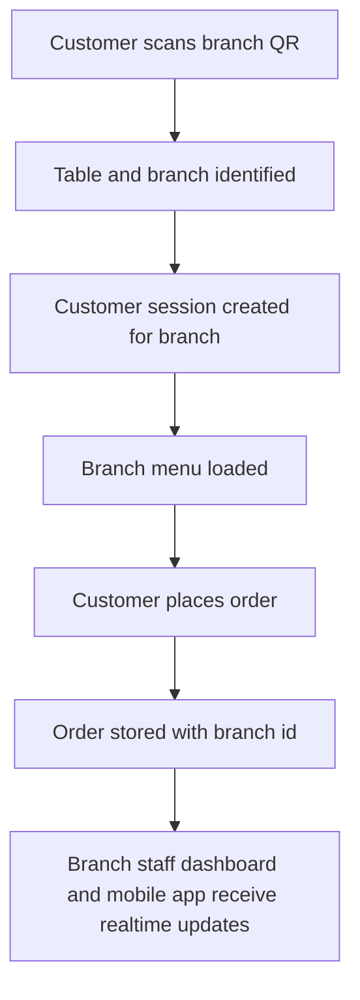
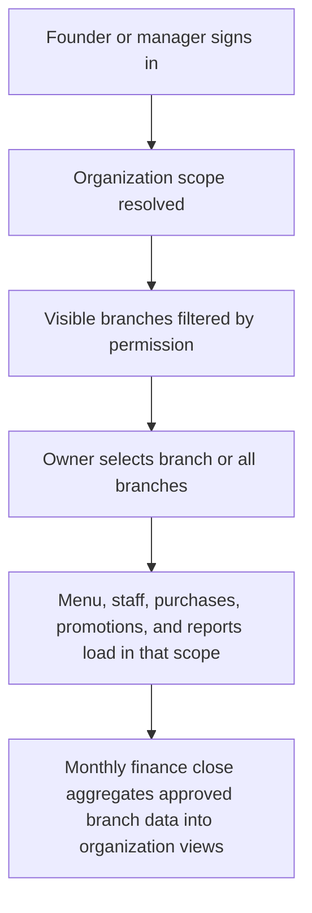

# Organization and Branch Menu Foundation

## Goal

Preserve the current customer ordering experience, then expand the platform so one business can run multiple branches with different menus, different staff, and shared founder-level control.

This should become the product foundation before deeper feature work on promotions, purchasing, payroll-grade attendance, and tax-ready reporting.

## What Stays Stable

- customer QR ordering flow
- customer session and table flow
- multilingual customer menu support
- branch-level live order operations

The current ordering flow should stay branch-scoped. We should not redesign it unless a real operational problem forces that change.

## Core Business Model

### 1. Organization

The organization is the business control layer.

It owns:

- founders and co-founders
- finance permissions
- shared settings
- billing
- cross-branch reporting

### 2. Branch

Each branch is an operating restaurant.

A branch owns:

- its menu
- its prices
- item availability
- tables and QR codes
- staff and schedules
- attendance records
- purchases and local expenses
- branch-level reports

In the current codebase, the existing `restaurant` concept should become the branch-level unit. Multi-shop support should be added above it through an organization layer.

## Shared Founder Support

The system should support multiple owner-level people in one organization.

Recommended model:

- organization members for founders, finance partners, and trusted operators
- employee records for labor and attendance only
- scoped access per branch where needed

Recommended owner-side roles:

- `founder_full_control`
- `founder_operations`
- `founder_finance`
- `accountant_readonly`
- `branch_general_manager`

This keeps control, payroll, and audit responsibilities clean.

## Branch-Specific Menu Strategy

This is the most important product update from your latest direction.

### Product Rule

Each branch can have a different menu.

That difference may include:

- categories
- items
- prices
- tax treatment
- availability
- seasonal items
- branch-only items
- hidden items

### Implementation Rule

Keep menus branch-scoped first.

That means the simplest and safest next step is:

- one branch has one active menu set
- customer ordering reads the branch menu only
- menu changes affect only that branch
- owners can copy a menu from another branch when opening a new shop

### Why this is the right first move

It protects the current customer ordering flow and avoids premature complexity.

If we introduce a global catalog too early, the system becomes harder for owners to understand and harder for AI agents to maintain safely.

### Recommended Rollout

#### Phase 1: Branch menu independence

- keep menu data branch-scoped
- add owner tools to duplicate menu data from one branch to another
- add branch menu comparison for prices and availability
- add import/export for branch menu maintenance

#### Phase 2: Shared menu templates

After branch operations are stable, optionally add:

- organization-level menu templates
- branch overrides for price and availability
- selective sync from template to branch

This should be optional, not required for launch.

## Customer Ordering Data Flow

## Owner Operations Data Flow

## Data Modeling Direction

### Add above the current restaurant layer

- `owner_organizations`
- `organization_members`
- `organization_restaurants`
- `organization_member_shop_scopes`
- `organization_member_permissions`

### Keep branch-owned domains explicit

- `menu_categories`
- `menu_items`
- `tables`
- `employees`
- `attendance_records`
- `purchase_orders`
- `expenses`
- `branch_promotions`

### Add monthly finance snapshots

- `branch_monthly_finance_closures`
- `organization_monthly_finance_rollups`

These snapshot tables are important for stable reporting, accountant exports, and AI-agent maintainability.

## Mobile-First Owner Design Rules

- default to one clear branch picker
- show only the most urgent actions first
- use short action labels
- reduce deep settings pages
- design owner actions around today, this week, and this month

The owner should be able to do most daily work from a phone:

- switch branch
- check who is late
- approve attendance exceptions
- review sales
- create a quick discount or promotion
- record a purchase

## AI-Agent Maintainability Rules

- keep authorization logic centralized
- keep finance calculations in one domain layer
- keep branch scope explicit in every route and query
- keep background jobs separate from route handlers
- define schema contracts clearly for each domain
- add invariant tests for money, permissions, and attendance approvals

The system should be easy for AI agents to extend without creating hidden coupling across orders, reports, and permissions.

## Recommended Next Implementation Order

1. Build organization and shared-founder access above the current restaurant layer.
2. Keep the current customer ordering flow intact and formalize branch-scoped menu ownership.
3. Add branch menu copy and branch menu comparison tools.
4. Complete secure attendance, approvals, and payroll-grade daily hour summaries.
5. Add purchases, expenses, and monthly finance closure snapshots.
6. Add promotions and discount codes with branch scope and audit logs.

## Launch Guidance

For the Japan-first release to Vietnamese owners:

- make branch operations simple first
- make permissions trustworthy
- make monthly numbers exportable
- keep multilingual UI flexible
- avoid adding powerful but confusing abstractions too early

That gives the business a strong base for Japan first, then Vietnam and other markets later.
